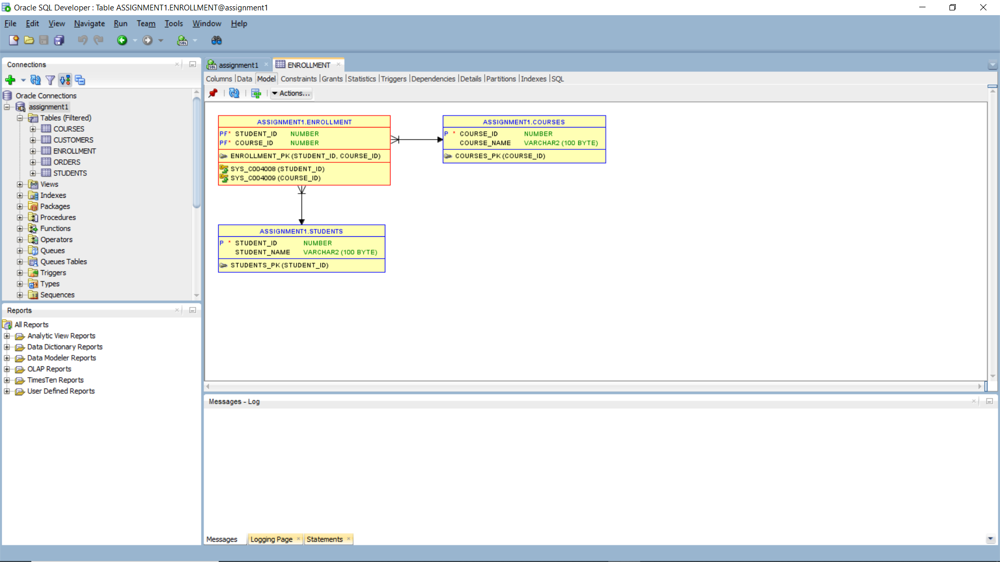
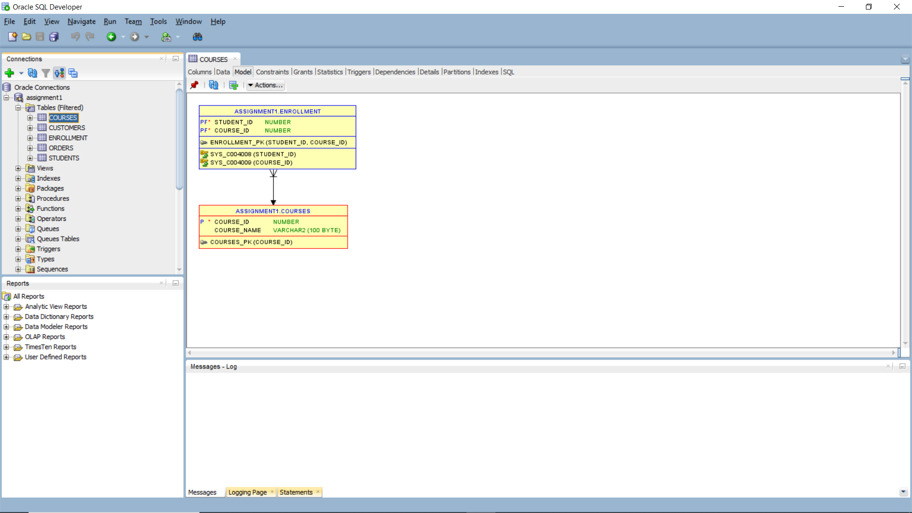
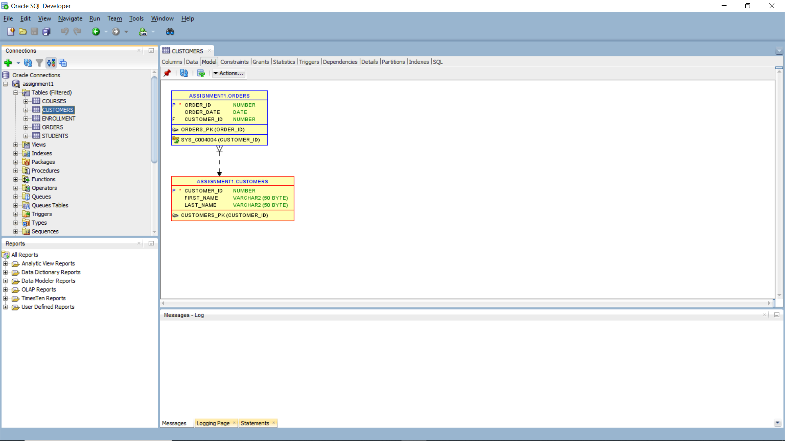
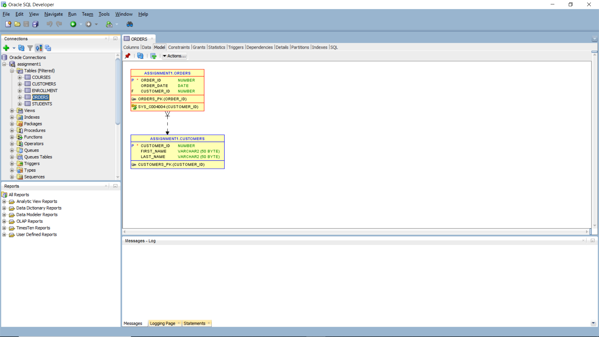
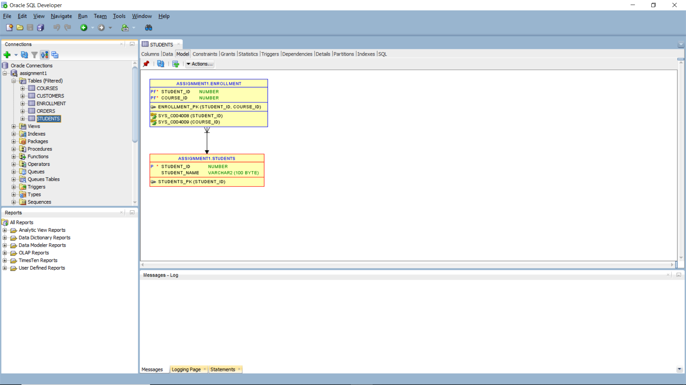
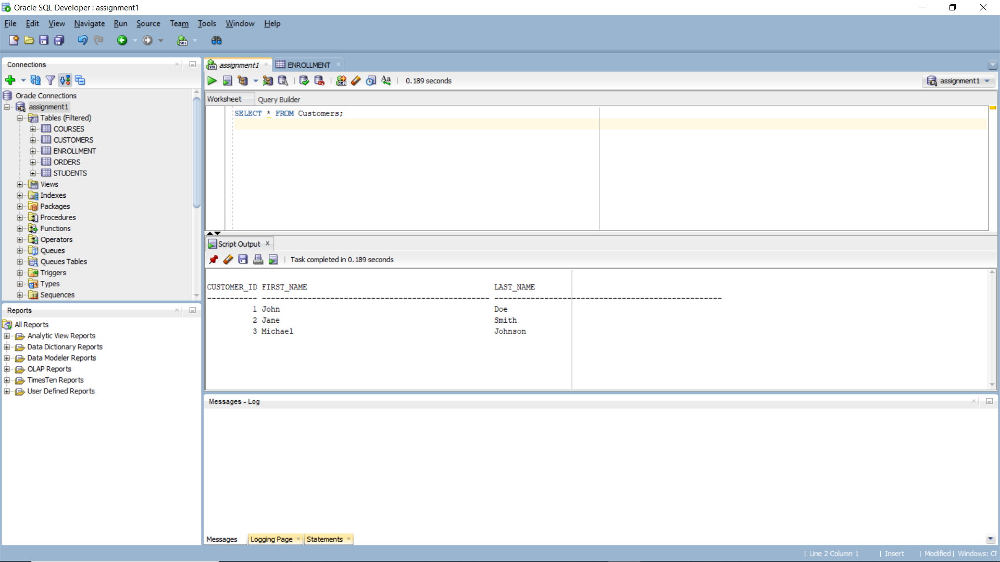
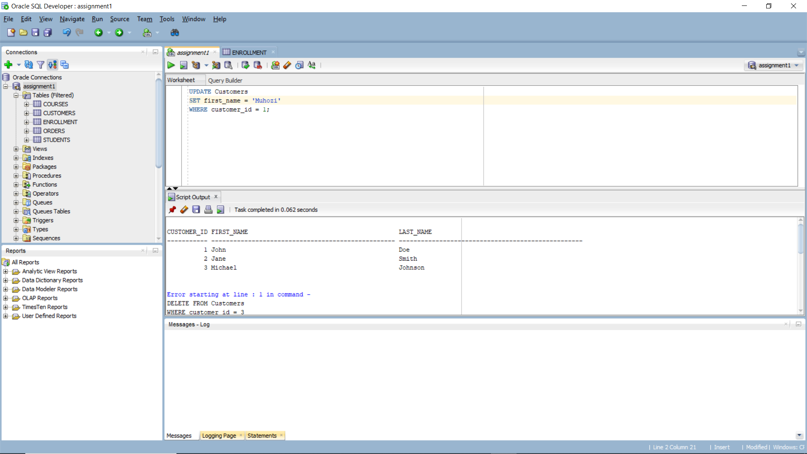
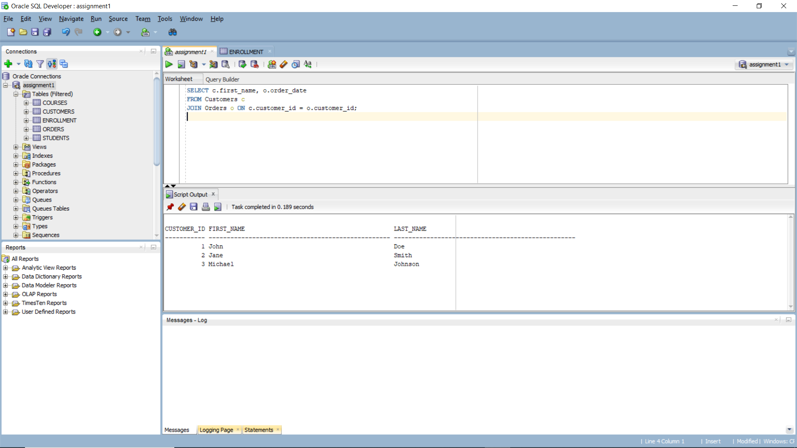
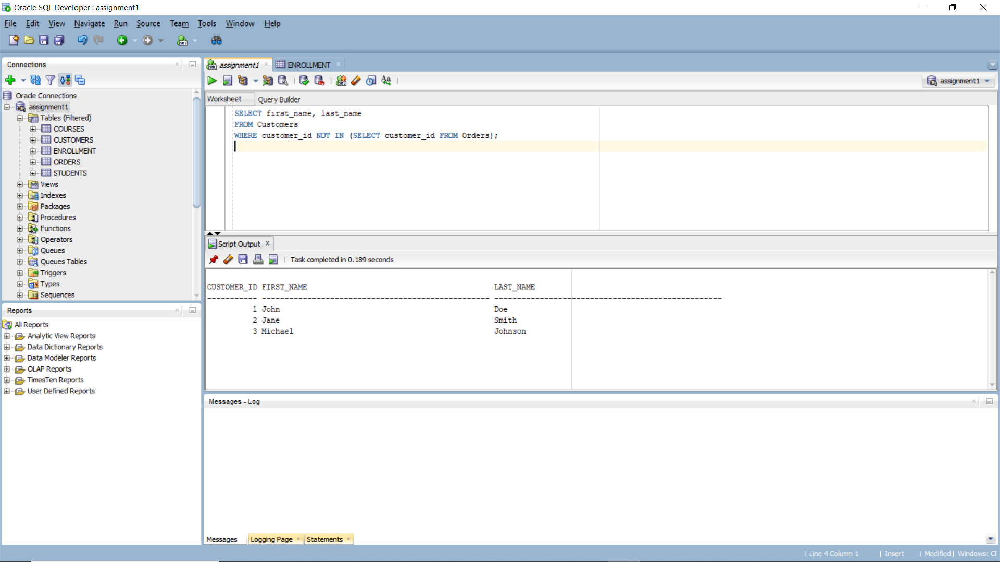

# Oracle SQL Test Scripts

## Overview

This repository contains SQL scripts for managing a customer order system, featuring `Customers` and `Orders` tables. The system enables the addition, modification, and deletion of customer information along with their associated orders.

## Table Structure

### Customers Table
- **Fields**: 
  - `customer_id` (Primary Key)
  - `first_name`
  - `last_name`

### Orders Table
- **Fields**: 
  - `order_id` (Primary Key)
  - `customer_id` (Foreign Key)
  - `order_date`

## SQL Commands Executed

### Data Definition Language (DDL)
- **Tables Created**: 
  - `Customers`
  - `Orders`
- **Keys Defined**: 
  - Primary keys for each table
  - Foreign keys to establish relationships

### Data Manipulation Language (DML)
- **Operations Performed**: 
  - Inserted new records
  - Updated existing records
  - Deleted records as necessary

### Joins and Subqueries
- Executed queries to retrieve and manipulate customer and order data using joins and subqueries.

## Conceptual Diagrams

## Sample SQL Queries

### Select Query

### Update Query

### Join Query

### Subquery

## Query Results Explanation

1. **Select Query**: 
   - Retrieves all records from the `Customers` table, displaying `customer_id`, `first_name`, and `last_name`.

2. **Update Query**: 
   - Updates the `first_name` of the customer with `customer_id = 1`, changing it from "John" to "Muhozi".

3. **Join Query**: 
   - Performs an inner join between `Customers` and `Orders`, returning the `first_name` and `order_date` for customers who have placed orders.

4. **Subquery**: 
   - Retrieves customers who have not placed any orders by filtering out those with `customer_id` in the `Orders` table.

## Transaction Explanation

A transaction in SQL is a sequence of operations executed as a single unit of work. Transactions are managed using commands like `COMMIT` and `ROLLBACK` to ensure data integrity and consistency.
